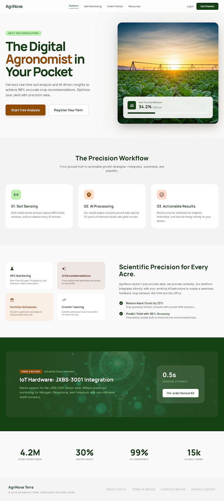
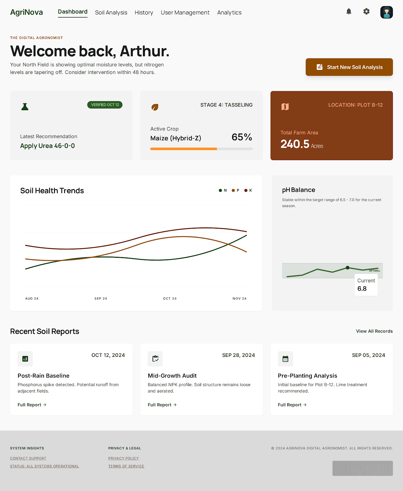
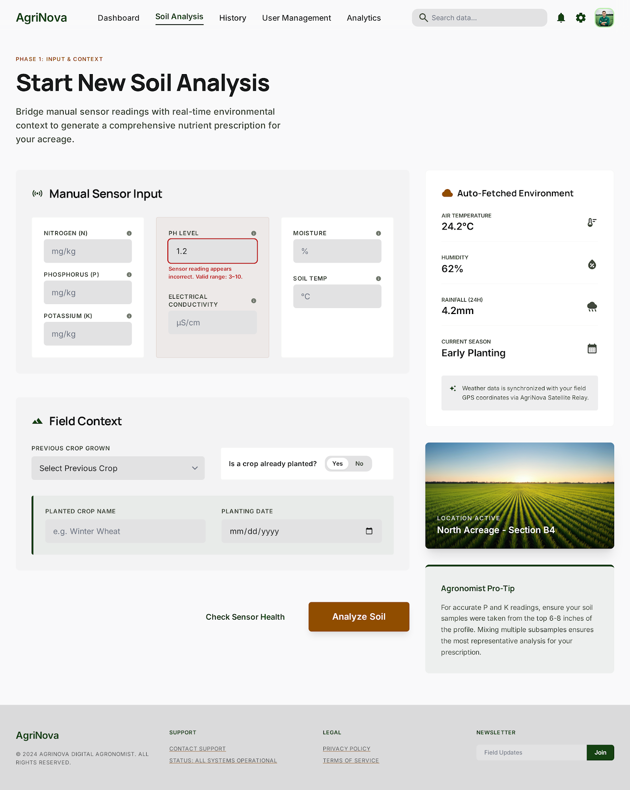
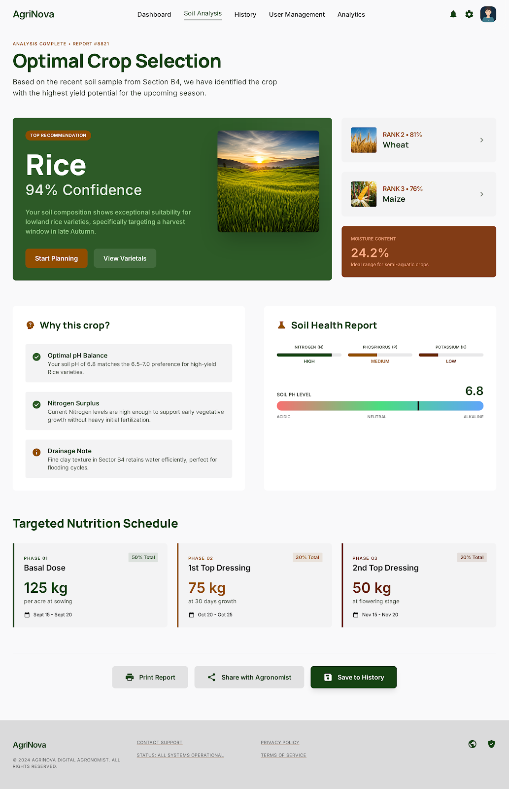

<div align="center">

# 🌱 AGRINOVA — ML-Powered Agriculture

### *"Democratizing scientific farming through intelligent prediction."*


---

> **⚠️ IMPORTANT: Decoupled Full-Stack Architecture.**  
> **AgriNova separates edge computing from heavy ML processing.**  
> Built with a high-performance **Next.js** frontend and a dedicated **FastAPI Python** backend powering complex XGBoost models.  
> Data is safely archived using Prisma ORM connected to **PostgreSQL**.

---

</div>

## 📸 Screenshots

<div align="center">

### 🖥️ Landing Page — The AgriNova Experience


---

### 📊 Farmer Dashboard — Real-time Crop Analytics


---

### 🧪 Soil Analysis — Intelligent Data Entry


---

### 📑 Insight Results — Precision Recommendations


</div>

---

## 🚀 What is AgriNova?

**AgriNova** is a state-of-the-art agricultural web application designed to democratize scientific farming. Powered by an ensemble of custom XGBoost Machine Learning models and a dynamically adaptive Rule Engine, AgriNova offers precision-guided Crop Recommendations, Targeted Fertilization mappings, and intelligent Weather-Responsive Irrigation timelines directly to farmers.

This isn't your average farm tracking app. This is **a complete algorithmic ecosystem for modern agriculture**.

---

## 🎬 How It Works — Core Features

### 1. 🧠 Intelligent Crop Prediction Engine

At the core lies our heavy prediction layer. It leverages XGBoost matrices trained on multi-dimensional environmental data points:
- Nitrogen (N), Phosphorous (P), Potassium (K)
- Humidity, Rainfall, pH Levels
- Calculates hyper-accurate yield predictions to maximize harvest.

### 2. 💧 Adaptive Irrigation & Water Cycles

AgriNova dynamically calculates exact watering intervals based on a farmer's registered `Soil Type` (e.g., Sandy vs Black Cotton). It scales inversely against live `OpenWeatherMap API` rainfall estimates, ensuring smart water conservation and preventing over-irrigation.

### 3. 🎯 Context-Aware Dashboarding

The UI intuitively transforms based on the user's current crop state:
- **No crop planted:** Engine performs deep predictive analysis.
- **Crop active:** Predictive tools step back, mapping visually onto Growth Stages, Fertilizer Dosing schedules, and Vegetative Tracking.

### 4. 🗄️ Historical Full-Reporting

We deeply connect into PostgreSQL schemas via Prisma ORM to archive Soil Analyses. The system effortlessly hydrates and rebuilds full generative UI reports without repeatedly pinging the ML infrastructure.

### 5. 🔤 Spelling Anomaly Correction

To account for real-world user input, the backend natively utilizes `difflib` string-recognition logic to smoothly override any crop spelling mistakes made by farmers, matching them strictly against our trained model bounds.

---

## 🏗️ Architecture & Tech Stack

AgriNova operates on a decoupled Full-Stack architecture spreading computational load efficiently.

### 🌐 Frontend (Application Layer)

| Technology | Role |
|-----------|------|
| **Next.js 15/16** | App Router framework with React Server Components |
| **TypeScript** | Strict type-safety across the platform |
| **Tailwind CSS** | Modular styling & utility classes |
| **Recharts** | Dynamic NPK Timeline mapping & pH Scaling |
| **NextAuth** | Secure JWT-based authentication |
| **Prisma ORM** | Type-safe database mapping connecting to PostgreSQL |

### 🧠 Backend (Machine Learning Server)

| Technology | Role |
|-----------|------|
| **FastAPI** | High-performance API routing and Python service |
| **XGBoost** | Extreme Gradient Boosting prediction algorithms |
| **Scikit-Learn** | Data preprocessing and scaling encoders |
| **Mathematics** | Custom ML scaling mechanics down to `json.dumps()` |

---

## 📁 Project Structure

```
AgriNova/
├── frontend/                 # Next.js UI Application
│   ├── src/app/              # Next.js App Router Pages
│   ├── src/components/       # Reusable React components
│   └── prisma/               # Database schemas and models
│
├── ml-server/                # Python FastAPI Backend
│   ├── app/main.py           # Server entrypoint
│   └── *.pkl                 # Serialized ML Models
│
├── ml-training/              # Jupyter Notebooks & raw datasets
└── UI/                       # Design assets and screenshots
```

---

## ⚡ Quick Start

Because the platform is decoupled into a Client layer and an Algorithm layer, both platforms must be spun up side by side.

### 1. Initialize The Machine Learning Engine

Navigate to the `ml-server` directory and launch the API locally.

```bash
# Enter the backend directory
cd ml-server

# Activate your virtual environment
source .venv/bin/activate

# Install dependencies (if needed)
pip install -r requirements.txt

# Boot the server
uvicorn app.main:app --reload --port 8000
```
> *Model matrices load into cache and the server boots on `http://127.0.0.1:8000`.*

### 2. Launch The Next.js Interface

Open a second terminal instance and boot the React Engine.

```bash
# Enter the frontend directory
cd frontend

# Install dependencies
npm install

# Start development server
npm run dev
```

> *The platform will successfully map across `http://localhost:3000`.*

---

## 🎯 Key Highlights for Judges

| Feature | Implementation |
|---------|---------------|
| **🤖 Decoupled ML Execution** | Heavy algorithmic computing separated via FastAPI for non-blocking UI |
| **💧 Weather-Aware Scheduling** | OpenWeatherMap combined with Soil parameters for dynamic irrigation logic |
| **📊 Recharts Analytics UI** | Beautiful, dynamic timeline rendering for Crop Stages & Fertilizer Plans |
| **💾 Bulletproof Persistence** | Robust PostgreSQL schema designed to archive continuous analysis tests |
| **⚡ Edge-Ready Frontend** | Server Actions and React Server Components for ultra-fast TTFB |
| **🛡️ Resilience Engine** | Built-in smart autocorrect against imperfect farmer inputs |

---

<div align="center">

### Engineered natively for stability, responsiveness, and actionable precision in Agriculture.

**AgriNova** — *Empowering the farms of the future.*

</div>
